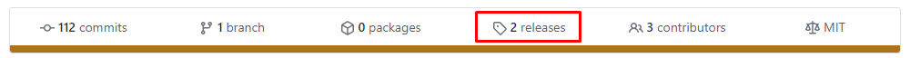
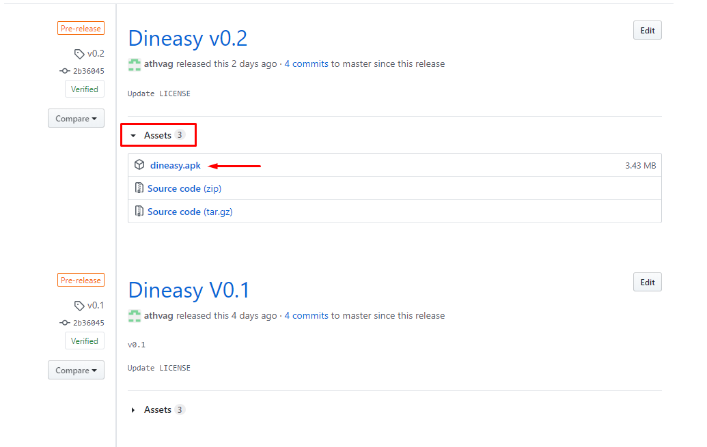

  

## Release Notes

  <b>Αρχικά για να δείτε στην πράξη αυτά που υλοποιήσαμε σας προτείνουμε να κατεβάσετε απο κινητό το dineasy.apk που βρίσκεται στην καρτέλα release </b>
  
  
  Στο release έχουμε υλοποιήσει QR Scanner για το οποίο θα χρειαστεί να σκανάρετε το παρακάτω QR: 

   
  <b>Εναλλακτικά</b> μπορείτε να δείτε την εφαρμογή μέσω ενός emulator, κατεβάζοντάς την στο Android Studio. Για να είναι εφικτό αυτό, στο τελευταίο commit παρακάμψαμε το QR Scanner, μιας και δεν είναι δυνατόν να γίνει Scan QR στο emulator, και έτσι μπορείτε να προχωρήσετε στο επόμενο βήμα απλά πατώντας το κουμπί "Scan QR"   

 
 Για να κάνετε login ως Basic User βάζετε username "user" και password "1234"  
  Για να κάνετε login ως Business Owner βάζετε username "admin" και password "1234"  

